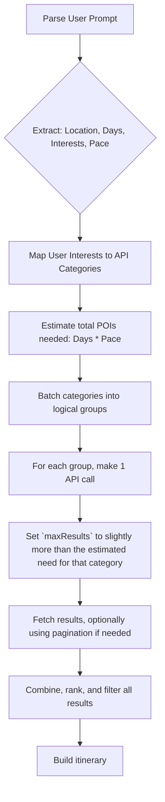

[Steps : ask_llm] LLM response received.
Of course. This is a classic problem in travel and mapping applications. The key is to balance comprehensiveness with efficiency, avoiding both too many API calls (which are slow and costly) and too few (which might miss important data).

Here’s a structured strategy to decide how many API calls to make and what to fetch in each one.

### The High-Level Strategy

Your goal is to **minimize the number of API calls** while **maximizing the relevance and coverage** of the Points of Interest (POIs) you retrieve for the itinerary.

You will achieve this by:
1.  **Analyzing the User's Prompt** to extract key parameters.
2.  **Batching Requests** intelligently by category and geography.
3.  **Implementing Pagination** if the API supports it.
4.  **Caching** results for subsequent parts of the itinerary or future requests.

---

### Step 1: Analyze the User's Prompt (The "What")

Before making any API call, parse the user's request for critical information. You need to extract:

*   **City/Location:** The primary geographic boundary.
*   **Trip Duration:** `3 days`, `weekend`, `one week`. This is the most important factor for deciding *how many* POIs to fetch.
*   **Interests & Categories:** Explicitly stated (`museums`, `hiking`, `nightlife`) or implied (`family-friendly`, `romantic`).
*   **Pace/Style:** `packed itinerary` vs. `relaxing getaway`. This affects the density of POIs you'll recommend per day.
*   **Special Requirements:** `wheelchair accessible`, `kid-friendly`, `budget`.

**Example Prompt:** *"Plan a relaxed 3-day cultural trip to Paris for my family with two young children."*

*   **Location:** `Paris`
*   **Duration:** `3 days`
*   **Interests:** `Cultural` (implies museums, historical sites), `Family-friendly`.
*   **Pace:** `Relaxed` (suggests fewer POIs per day).
*   **Special:** `Children`.

---

### Step 2: Decide *What* to Fetch in Each API Call (The "How")

You won't fetch everything at once. You'll batch your requests. The two primary axes for batching are **Categories** and **Geography/Proximity**.

#### A. Batch by Category (The Most Common Method)

Group the requested interests into logical batches that align with the API's category taxonomy.

1.  **Map User Interests to API Categories:** Your API likely has a list of supported categories (e.g., `tourist_attraction`, `museum`, `park`, `restaurant`). Create a mapping from user terms (`cultural`, `foodie`) to these API categories.
    *   `Cultural` -> [`museum`, `art_gallery`, `historical_landmark`]
    *   `Family-friendly` -> [`park`, `zoo`, `aquarium`]
    *   `Food` -> [`restaurant`, `cafe`]

2.  **Make One API Call per Category Group:** For the Paris example, your calls might be:
    *   **Call 1:** Fetch `museum`, `art_gallery`, `historical_landmark` in `Paris`.
    *   **Call 2:** Fetch `park`, `zoo`, `aquarium` in `Paris`.
    *   **Call 3 (Optional):** Fetch highly-rated `restaurant` and `cafe` (you might filter these by a "kid-friendly" tag later).

**Why this works:** It's efficient. You get all relevant POIs for a theme in one call, making it easy to sort and rank them later (e.g., by rating).

#### B. Batch by Geography / Proximity (For Large Cities or Multi-City Trips)

If the user's itinerary covers a large area (e.g., "California road trip"), batching by city or region is better.

1.  **Divide the Itinerary by Day/Location:** For a trip to "Rome and Florence," you'd make at least two calls: one for `Rome` and one for `Florence`.
2.  **Use the API's `radius` or `viewport` parameters:** For a large city like Tokyo, you might break it down into districts (Shinjuku, Shibuya). You'd make a call for `museums` in `Shinjuku`, then another for `museums` in `Shibuya`.

**Why this works:** It prevents the API from returning an overwhelming number of results for a huge geographic area, many of which are too far apart to be practical for a single day.

---

### Step 3: Decide *How Many* POIs to Fetch per Call

You don't need to show the user 100 museums for a 3-day trip. You need the *best* 10-15.

1.  **Estimate POIs per Day:** A rough heuristic:
    *   **Relaxed Pace:** 2-3 major attractions + 1-2 meals.
    *   **Moderate Pace:** 3-4 major attractions + 2-3 meals/coffee breaks.
    *   **Packed Pace:** 4-5+ major attractions + meals on the go.
    *   For a 3-day *relaxed* trip, you might need ~12-15 total candidate POIs to choose from.

2.  **Use the API's `maxResults` Parameter:** Most APIs let you set a limit (e.g., `maxResults=20`). **Set this limit based on your estimated need.**
    *   For a category like "museums," fetching the top `20` rated ones in Paris is more than enough to build a 3-day itinerary. You don't need 200.

3.  **Pagination:** If the API uses pagination (e.g., `pageToken`), your first call might only get you 20 results. You can make subsequent calls to get the next page **only if you need more data** (e.g., for a very long trip or if the first results are unsatisfactory).

---

### Step 4: Putting It All Together - A Practical Example

**User Prompt:** *"I need a 4-day food and history tour of Rome. We love pasta and ancient ruins."*

**Your Action Plan:**

1.  **Parse the Prompt:**
    *   Location: `Rome`
    *   Duration: `4 days`
    *   Interests: `Food` (`restaurant`, `pasta`), `History` (`ancient_ruins`, `museum`).
    *   Pace: Not specified, assume `moderate`.

2.  **Map to API Categories:**
    *   `History` -> [`museum`, `art_gallery`, `historical_landmark`, `place_of_worship`]
    *   `Food` -> [`restaurant`] (maybe also `local_flavor` or `point_of_interest` if the API has it)

3.  **Plan the API Calls:**
    *   **Call 1 (History):**
        *   `location = Rome`
        *   `categories = ["museum", "historical_landmark"]`
        *   `maxResults = 25` (Top 25 historical sites is plenty for 4 days)
        *   `sort = -rating` (Hypothetical syntax for "sort by rating descending")
    *   **Call 2 (Food):**
        *   `location = Rome`
        *   `categories = ["restaurant"]`
        *   `maxResults = 30` (You'll need more options for multiple meals per day)
        *   `keyword = "pasta"` (If the API supports a keyword filter!)
        *   `sort = -rating`

4.  **Post-Processing:**
    *   You now have a list of ~25 historical sites and ~30 restaurants.
    *   Your algorithm can now cluster these POIs geographically to build logical daily itineraries (e.g., put the Colosseum, Roman Forum, and a highly-rated nearby restaurant all on the same day).

### Summary of Decision Flowchart

**Final Pro Tip:** Cache your API results! If a user is planning a 5-day trip to London, you might make one call for `museums` in `London` and reuse those results for all five days of the itinerary rather than making a new call for each day. This drastically reduces the number of API calls.